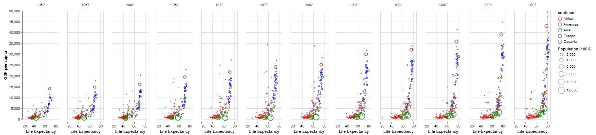

# Wealth and Life Expenctancy (Gapminder)
# Ben Fuqua
## "2021-09-25"
## class: "CSE 350 01"
## hours: .5 
## Palmer
----------------------------------------

# Background
One of the things I learned while making this chart is how to adjust the width of the chart. It is pretty simple in altair, all you do is add a .properties(width = , height = ). Another thing I learned is how to change the legend title, again you just add an argument of 'title = ' and then list your title and that's it! the power behind these graphing tools is amazing!

# Images

