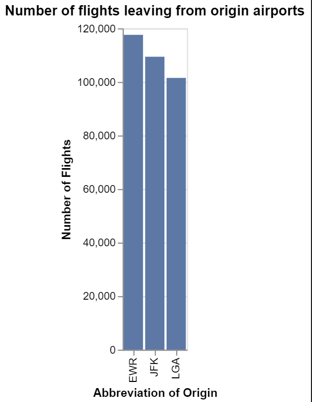
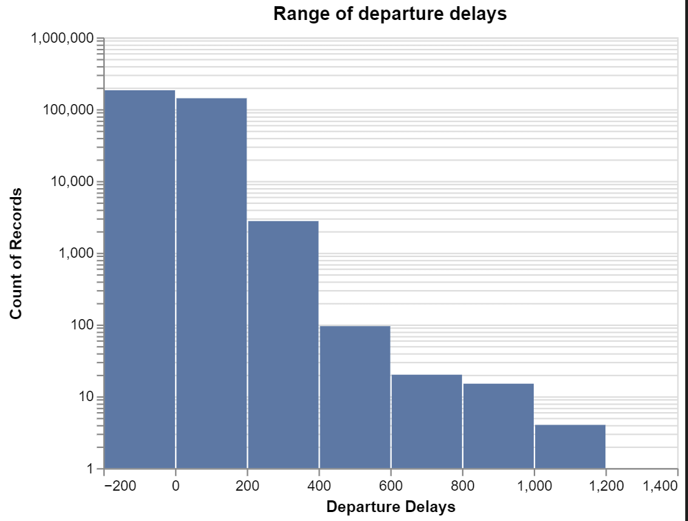
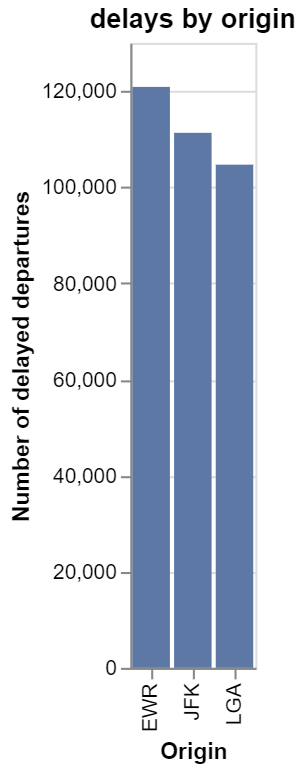

# Homework Title
# Ben Fuqua
## "2021-09-23"
## class: "CSE 350 01"
## hours: .5 
## Palmer
----------------------------------------


```python
import pandas as pd 
from pandas_profiling import ProfileReport as pr 
import altair as alt 
from nycflights13 import flights

```

# Question For RC&W attendance, what is the growth trend over time by department?


```python
import altair as alt
alt.data_transformers.enable('default',max_rows = None)
#%%
alt.Chart(flights).mark_bar().encode(
    alt.X('origin'),
    alt.Y('count()')
)
```

This helps us to see the univariate distribution for the number of flights that come from the places of origin. The scale wasn't super different so I didn't feel the need to re-size the scale
```python

#%%
alt.Chart(flights,title = 'Range of departure delays').mark_bar().encode(
    alt.X('dep_delay',bin = True, title = 'Departure Delays'),
    alt.Y('count()',scale = alt.Scale(type = 'log'))
)
```

There was a large variance between the bins and so I chose to take the log of the scale so we would be able to see more of the extreme values. I also chose to do a binned bargraph because this would help me to see the univariate distribution.
```python
# %%
alt.Chart(flights,title = 'delays by origin').mark_bar().encode(
    alt.X('origin',title = 'Origin'),
    alt.Y('sum(dep_delay)',title = 'Number of delayed departures')
)
```  

This graph shows the total time of delays for each airport. As we can see the EWR origin airport has the longest total delays! I chose to do a bar graph because it helps me to see the total amount by the categorical variable. 

