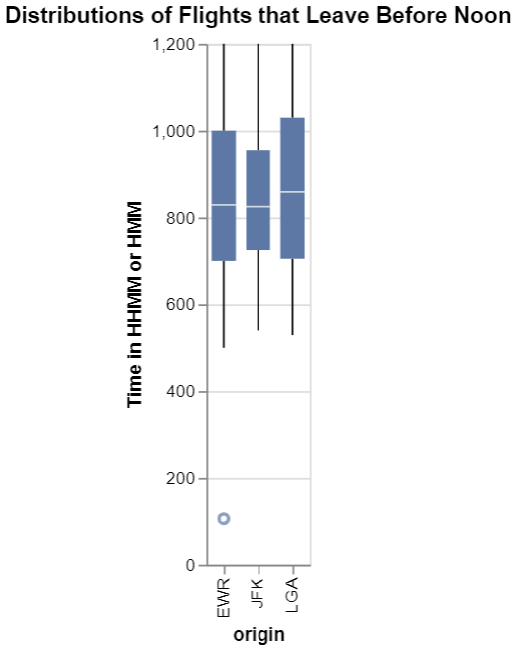
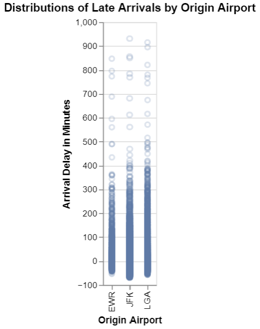
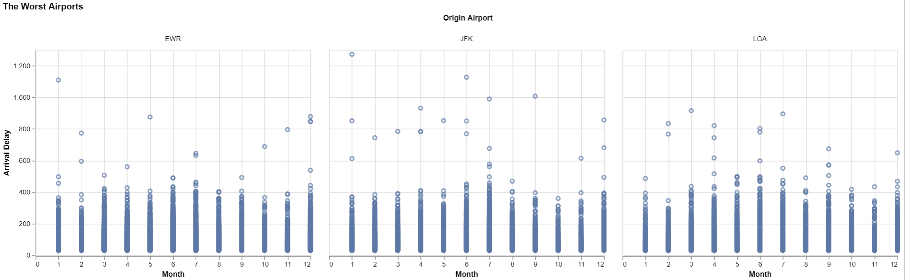

# Homework Title
# Ben Fuqua
## "2021-10-"
## class: "CSE 350 01"
## hours: .5 
## Palmer
----------------------------------------

# Case Study Questions
- For each origin airport (JFK, EWR, LGA), which airline has the lowest 75th percentile of delay time for flights scheduled to leave earlier than noon?
- Which origin airport is best to minimize my chances of a late arrival when I am using Delta Airlines?
- Which destination airport is the worst (you decide on the metric for worst) for arrival delays?

# Question 1
This is a chart which shows the distributions of the late arrivals for all origin airports and airlines. AS you can see JFK was the airport which had the lowest 75th percentile of delay when we take into account only flights that were scheduled to depart before noon. 

# Question 2
This is a chart of the distribution of occurances of late arrivals. It is important to note that I changed the opacity of the points so the darker areas have more occurances. EWR is the airport that has the lowest late arrival time and as you can see the distribution is solid until 150 where JFK is around 250 and LGA until 300. This means that EWR starts to have fewer occurances of late arrivals after 2.5 hours. I would choose EWR as my origin airport because of these two factors

# Question 3
to decide which airport was the worst, I first filtered the data to include any time greater than 30 minutes, because a 30 minute delay is annoying but often doesn't cause major problems. Then I grouped it by month so we can see the trends around the holidays because we all know that traveling around then is really bad due to volume and weather. When we look at the different airports there really isn't a huge variation per month under 400 minutes. EWR is definately the best airport because it has the least amount of arrival delays above 600, and on the flip side I would say JFK is the worst becuause they have the highest delay at 1200+ minutes in delays and the most above 600 minutes. JFK has the longest, and the highest count of long delays. 

