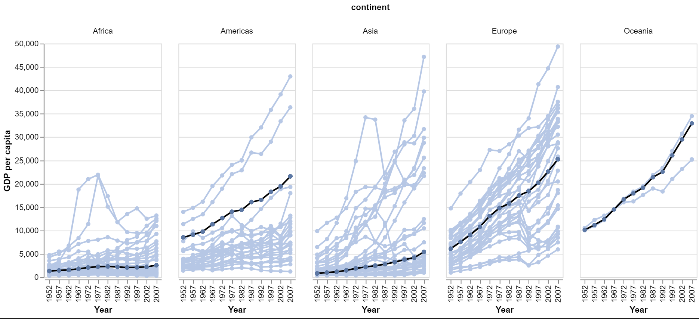
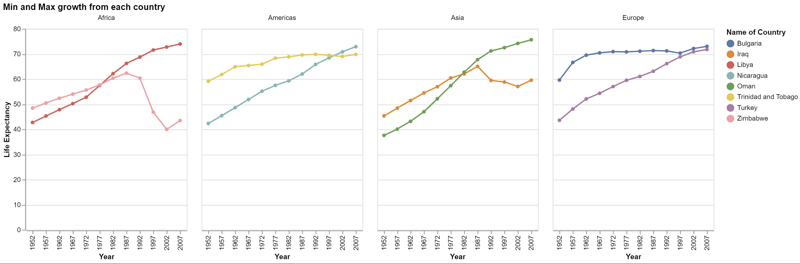

# W03 Individual Task: dplyr and Gapminder Part 2
# Ben Fuqua
## "2021-09-28"
## class: "CSE 350 01"
## hours: 2
## Palmer
----------------------------------------

# What I learned

I learned how to layer faceted plots, first you must build the plots individually, then you combine the plots. Once you have combined both plots is when you are able to split them into their seperate columns. 

I also learned how to take the weighted average. Python doesn't exactly have a function for this that returns things correctly so I had to manually create them and then map the weighted average back to the correct columns. It worked out in the end, I am still willing to continue with this course in python because I am learning a whole ton about graphing in altair and how to use the python syntax.

# Graphs

