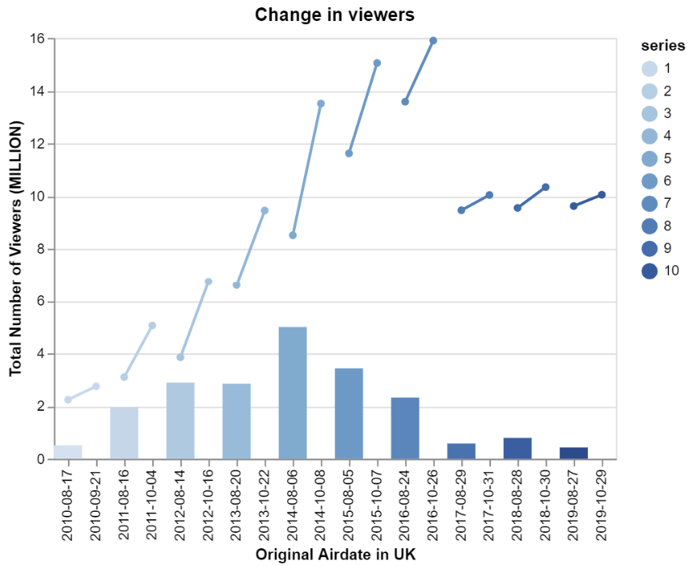
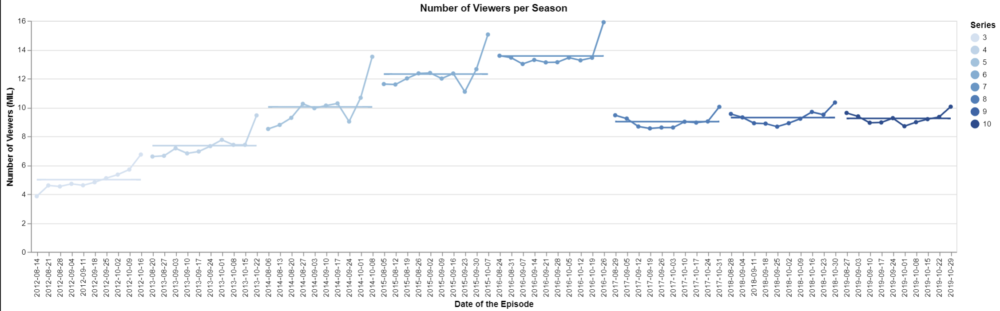

# Dplyr Intro & The Great British Bake-off
# Ben Fuqua
## "2021-09-30"
## class: "CSE 350 01"
## hours: 1.5 
## Palmer
----------------------------------------

# Image 1

In this graph, I have put the start and the end amounts on the graph, with the actual numerical change as a bar graph underneath. There is always an increase in the number of viewers, and for seasons 3-7 there was a big increase in the number of viewers. Something happened though in the last 3 seasons where they didn't have a huge spike and the number of viewers significantly dropped.  

# Image 2

It is interesting to see here how right before the finale the number of viewers drops below or to the mean. look at seasons 4-6 for a good representation of this. Also, as in the previous chart, we see there to be significantly less viewers in the final 3 seasons of the show. The last 3 seasons stay right around 10 million viewers where as seasons 5-7 all peak around 14 million+. 
