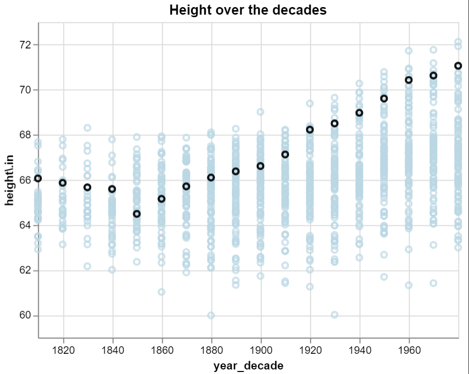
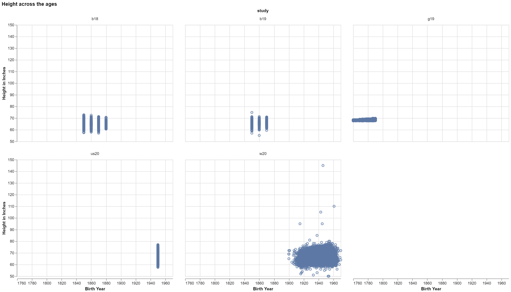

# Homework Title
# Ben Fuqua
## "2021-10-"
## class: "CSE 350 01"
## hours: .5 
## Palmer
----------------------------------------

# Graph 1

In this graph we have the decade along the bottom, and the height in IN along the left axis. The driving question for this study was, 'are humans getting taller as time goes on'. One important note to gleen from this chart is not only are humans getting taller, but the distribution of our height is also getting bigger. When we look at 1810, we see it spans between 63&68 and when we look at 1980 we see it spans from 63 as well to 72. It is interesting to see that not only have we been getting taller over the years, but the distribution has been getting bigger as well.

# Graph 2

in this graphic we can see the same thing across the different studdies. the first studdie 'g19' was done to cover the late 1700s the next two b18 & b19 were done around the same time and the distribution of the points is getting a little bit bigger now, then us20 and w20 were done around thes same years and here we see the distribution get much bigger. Although, I do think the points above 100 are technically outliers since the tallest man was only 8' 2" or (98"). But it is interesting to see them.

