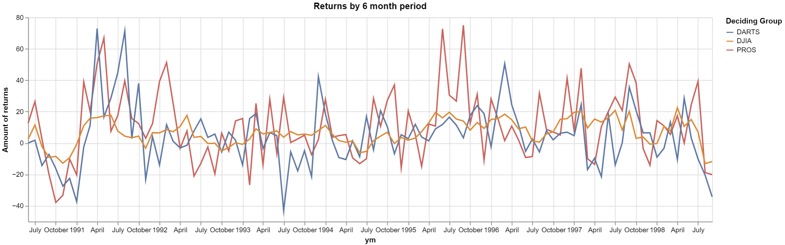

# Clean and Reformat (aka tidy) Stock Data
# Ben Fuqua
## "2021-10-6"
## class: "CSE 350 01"
## hours: 2
## Palmer
----------------------------------------

# Code

```python
data['year'] = data.contest_period.str.split('-',expand = True)[1].apply(lambda x: x[-4:])
data['month'] = data.contest_period.str.split('-',expand = True)[1].apply(lambda x: x[:-4])

data.loc[data.month == 'Febuary','month'] = 'February'
data.loc[data.month == 'Dec.', 'month'] = 'December'
```

# Chart

Here we have a chart that displays the total returns over six months starting in June of 1990. For example, when the chart shows 1991 April we know that this measure was taken in April of 1991 and it was in reference to October of 1990 (April_measure - October_measure). 



# New Table
| month     |   1990 |   1991 |   1992 |   1993 |   1994 |   1995 |   1996 |   1997 |   1998 |
|:----------|-------:|-------:|-------:|-------:|-------:|-------:|-------:|-------:|-------:|
| January   |  nan   |   -0.8 |    6.5 |   -0.8 |   11.2 |    1.8 |   15   |   19.6 |   -0.3 |
| February  |  nan   |   11   |    8.6 |    2.5 |    5.5 |    3.2 |   15.6 |   20.1 |   10.7 |
| March     |  nan   |   15.8 |    7.2 |    9   |    1.6 |    7.3 |   18.4 |    9.6 |    7.6 |
| April     |  nan   |   16.2 |   10.6 |    5.8 |    0.5 |   12.8 |   14.8 |   15.3 |   22.5 |
| May       |  nan   |   17.3 |   17.6 |    6.7 |    1.3 |   19.5 |    9   |   13.3 |   10.6 |
| June      |    2.5 |   17.7 |    3.6 |    7.7 |   -6.2 |   16   |   10.2 |   16.2 |   15   |
| July      |   11.5 |    7.6 |    4.2 |    3.7 |   -5.3 |   19.6 |    1.3 |   20.8 |    7.1 |
| August    |   -2.3 |    4.4 |   -0.3 |    7.3 |    1.5 |   15.3 |    0.6 |    8.3 |  -13.1 |
| September |   -9.2 |    3.4 |   -0.1 |    5.2 |    4.4 |   14   |    5.8 |   20.2 |  -11.8 |
| October   |   -8.5 |    4.4 |   -5   |    5.7 |    6.9 |    8.2 |    7.2 |    3   |  nan   |
| November  |  -12.8 |   -3.3 |   -2.8 |    4.9 |   -0.3 |   13.1 |   15.1 |    3.8 |  nan   |
| December  |   -9.3 |    6.6 |    0.2 |    8   |    3.6 |    9.3 |   15.5 |   -0.7 |  nan   |

