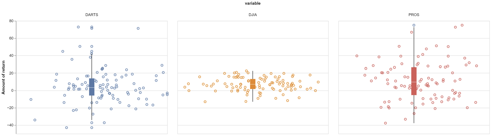

# Same Data Different Format
# Ben Fuqua
## "2021-10-6"
## class: "CSE 350 01"
## hours: 2 
## Palmer
----------------------------------------

# Chart
Here are the distributions of the earnings. It is interesting to see that DJIA kept within a range of -20->20, meaning they were more consistent. As for the pros, they had higher gains occasionally but also higher losses. Their 25% percentile actually dipped into the negatives where as DJIA did not. So depending on your version of 'better' you can argue that DJIA is better than the pros and vice-versa.

