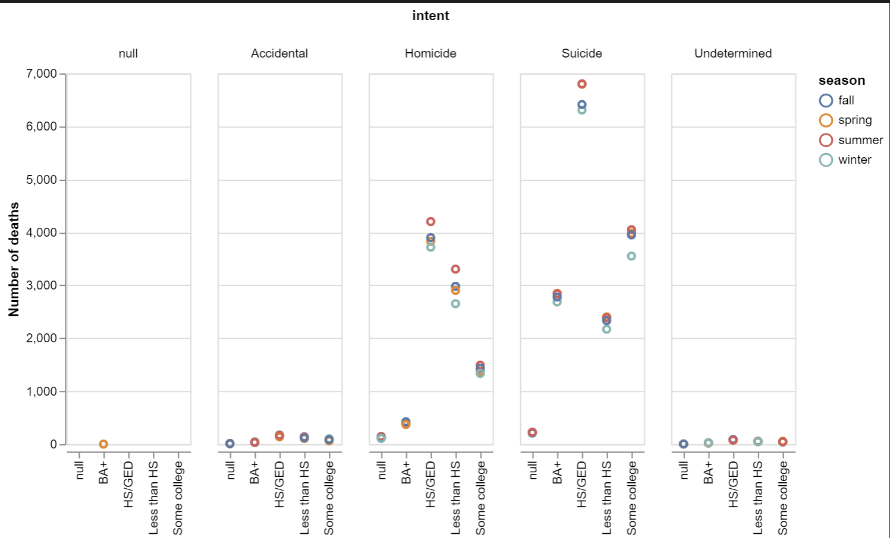

# Homework Title
# Ben Fuqua
## "2021-10-14"
## class: "CSE 350 01"
## hours: .5 
## Palmer
----------------------------------------

# Thesis of the video
There is more to gun violence than just who owns a gun. 

# A chart that adds to the story
One of the points that was made within the video was about the intent of the 'gun violence', I would like to present this graphic as a way to show that the majority of 'intent' was suicide, then followed by homicide. We could drastically change these numbers if we focused less on the 'problem' and more on the source of the problem. Saying we have a 'gun problem, guns are killing people' is like saying 'I have a spoon problem, it is making me fat'. If we were to dig down deeper and fix the problem we could lower the number of suicides per year by a whopping 21,000. 

# Commercial charts
When I was looking at the chart below, one thing was extremely prevalent. In all cases, There were more deaths in the summer time and the least amount of deaths were in the winter time. I didn't put a Y axis because I didn't want that to be the focus of my visual, but each line represents 100k deaths. I want the focus to be on the size of the bars. 

Again, the same thing holds true when we break it into education groups. Summer has more deaths than winter time, some times as big of a difference as 500 or more deaths. Another interesting piece of knowledge comes out from the graph below, it is about education. When education is taken into account, we see the highest amount of homicides and suicide comes from the HS/GED group. Meaning, those who only have a HS/GED degree are more like to commit suicide or to commit homicide. 

As a final wrap up thought, if we were to take the time to help those who have thoughts of suicide, and help our populous become more educated, this will drag those numbers down and our communities will be a safer, more wholesome place. 
