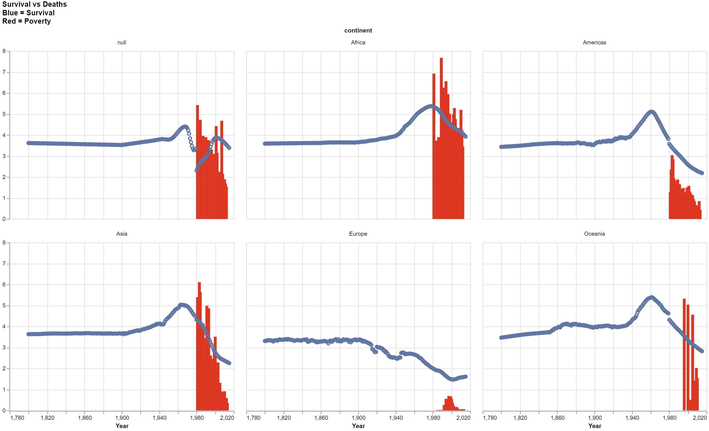

# World Data Investigation
# Ben Fuqua
## "2021-10-12"
## class: "CSE 350 01"
## hours: 1.5 
## Palmer
----------------------------------------

# Summary
This was something interesting I noticed from the number of deaths per woman compared to the suvivals per woman. When we look at chart 1, we see the number of survivals go down as poverty decreases. Which may seem a little backwards, but when we look at chart 2, we see deaths per woman decrease as well. So, the number of survivals decrease because they don't need to have as many babies. More babies are surviving in proportion to the number of deaths. 

Example: Asia's death's per woman goes down to basically zero so they can go down to 2.25 survivals per woman whereas before they were at 2.75 deaths per woman and 3.6 survivals per woman. 

# Chart 1

# Chart 2

