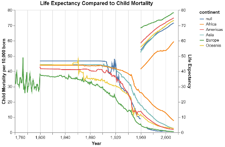

# World Data Investigations—Part 2
# Ben Fuqua
## "2021-10-12"
## class: "CSE 350 01"
## hours: 2.5 
## Palmer
----------------------------------------

# Summary
Child mortality rate has been an incedent of record for about 250 years. As you can see in the graph, we don't start seeing a record of the child mortality rate until the 1800s. Whereas life expectancy is something we have only begun to keep record of since the 1960s. Something that is interesting to note between these two variables, is the inverse correlation between them. When life expectancy goes up, child mortality goes down. This can be attributed to a few aspects of society; namely medicine, housing, food and hygine. 

# Chart

