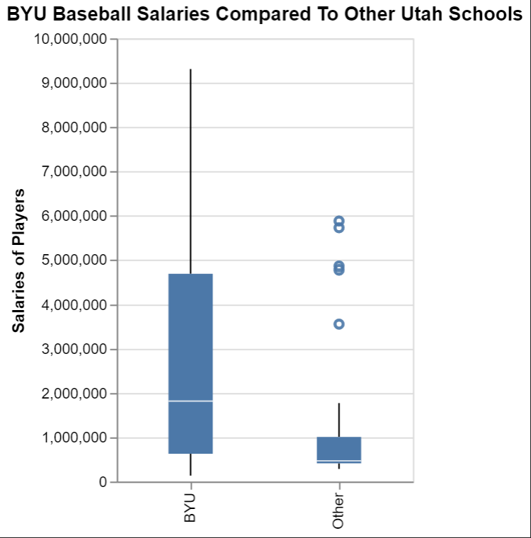
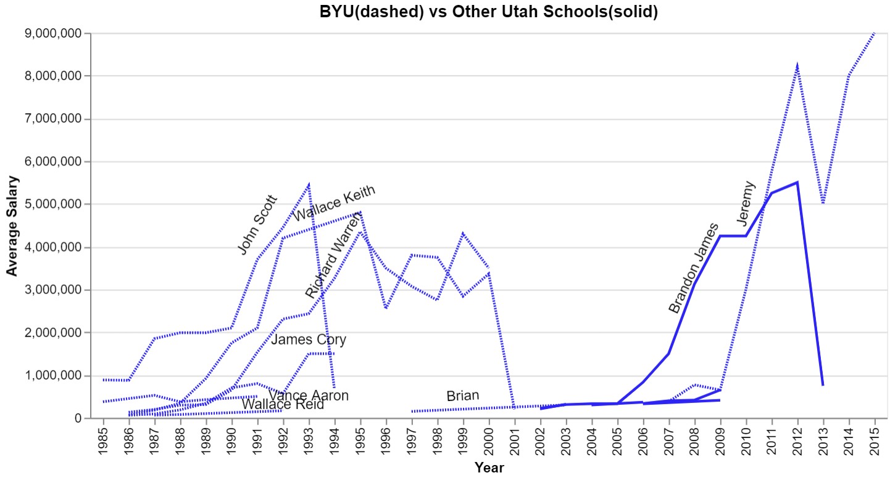

# Take me out to the ball game
# Ben Fuqua
## "2021-10-19"
## class: "CSE 350 01"
## hours: 1.5 
## Palmer
----------------------------------------

# Summary
### Question: Does BYU perform better than other schools in the MLB

The first chart is the distribution of the pay scale. As we can see, BYU has a greater range of pay than the other Utah schools. Where BYU has a mean of roughly 1.85 million and other Utah schools have a mean of roughly 600k. 

In the second chart I plotted the average change of adjusted salary over time. I named all of the BYU players becuase there was enough variation in them to make it meaning full, but as for the other Utah Schools I only plotted one because the other salaries were too close together to make the names fit legibly. Other Utah schools are actually higher than BYU from 2002 -> 2010, but thereafter other Utah schools average drops by about 2 million and BYU jumps by 2.7 million. Why this is, I'm not sure, but if pay scale is an accurate way of describing the preformance of BYU vs Other Utah schools, then BYU currently out preforms other schools by a large margin. 

# Charts

