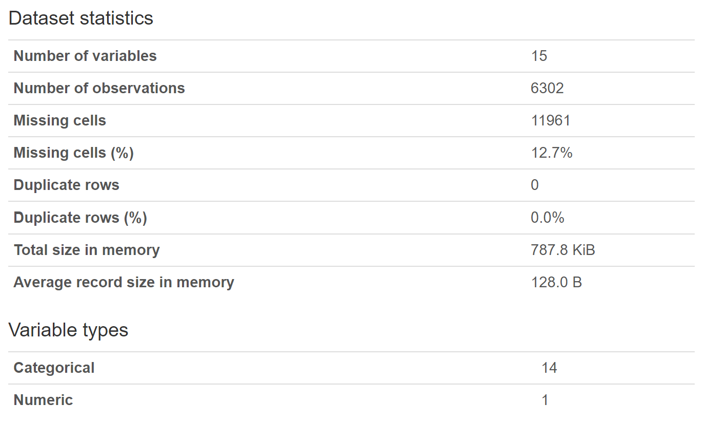
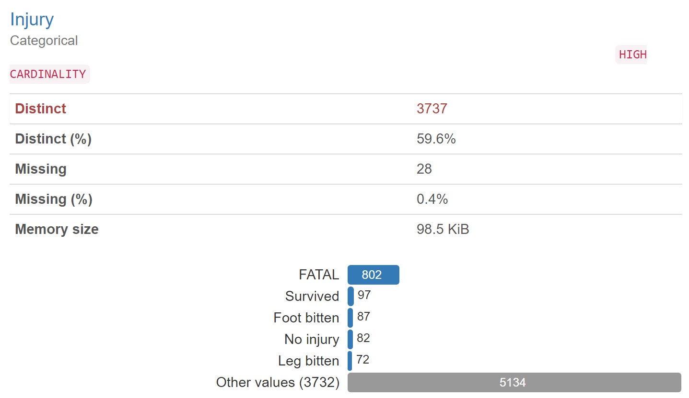

# Data To Answer Questions
# Ben Fuqua
## "2021-10-18"
## class: "CSE 350 01"
## hours:  
## Palmer
----------------------------------------

# Links To Data

https://www.kaggle.com/felipeesc/shark-attack-dataset  (has 2 data sets)

https://www.kaggle.com/adambens/global-shark-attack-file (has 1 data set)

- Due to the fact that both of these datasets are from kaggle, and used in competitions, we know these datasets are going to be good quality. I am not saying there won't be any cleansing/modifying that needs to happen, but I am saying there will be less errors in the data and it is bound to be more complete. 
- the first data set I can use for looking at the type of attacks within the united states
- Its sister file I can use for looking at the geographical location of the attack
- As for the final data set, it a world wide view of shark attacks so I will be able to see how the US compares to other countries. 

# Data Exploration

### Read-In Process
Because this was a kaggle datset, all I had to do was download the file to my local machine and then use the pandas method '.read_csv()' to read in the file sucessfully. 

### Quality Of The Data

Python has this wonderful package called 'Pandas_profiling'. This package automatically takes care of the data validation and quality process by summarizing the data then exporting that summary to an IFrame which you can then view and explore. EX.

Here we can see the general statistics of the data set as a whole, I know the missing cells column says 11961, it is counting a cell as a row and a column. With that in mind, 6302 rows x 15 columns  = 94,530 cells which the proportion is roughly 12.7%. 

I know the categorical areas are going to take some work, because this is data from as far back as 500 A.D. so there is bound to be some changes that need to be made to this data. EX.

Here we can see that this column has high cardinality, due to the wide range of injuries. I will need to break it down and classify them into general body parts to show where the injury occured. 

### Relation to Question

The only limitation I see, are my time series questions. Yes, this data does span across multiple eras, but we aren't measuring the difference in year to year, or looking for trends in relation to time. So those questions will need to be changed, but other than that I am confident that I am able to answer the other questions I had about the data. 

### Additional Questions
Some questions that have arrisen from exploring this data revolve mainly around the injury itself and the location of the injury. I think it would be interesting to see if one body part has received more attacks than another. It would also be interesting to see where these occured and what circumstances lead to these injuries(what activity was the person doing).
