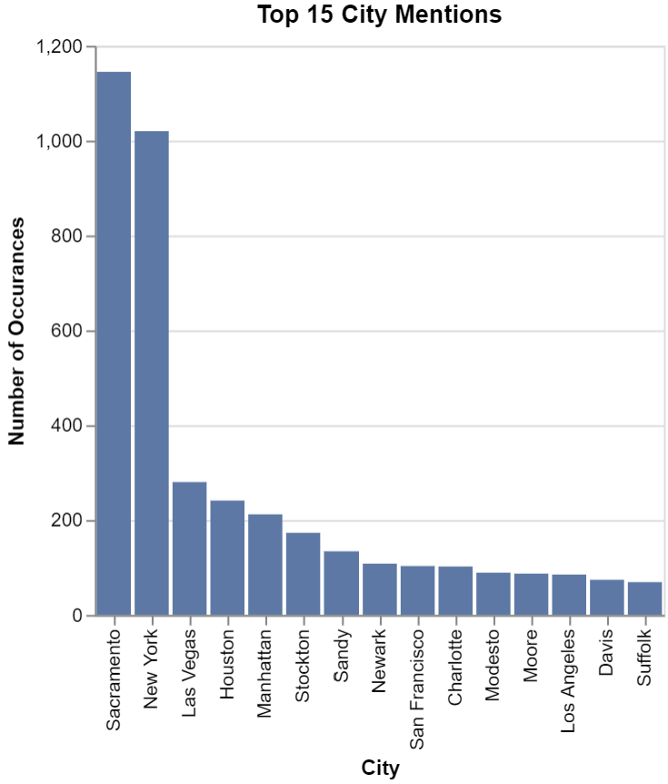
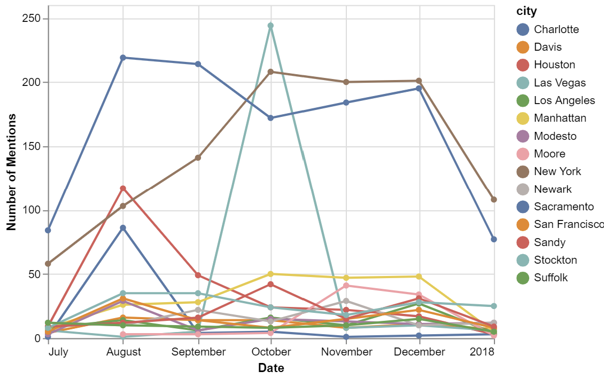
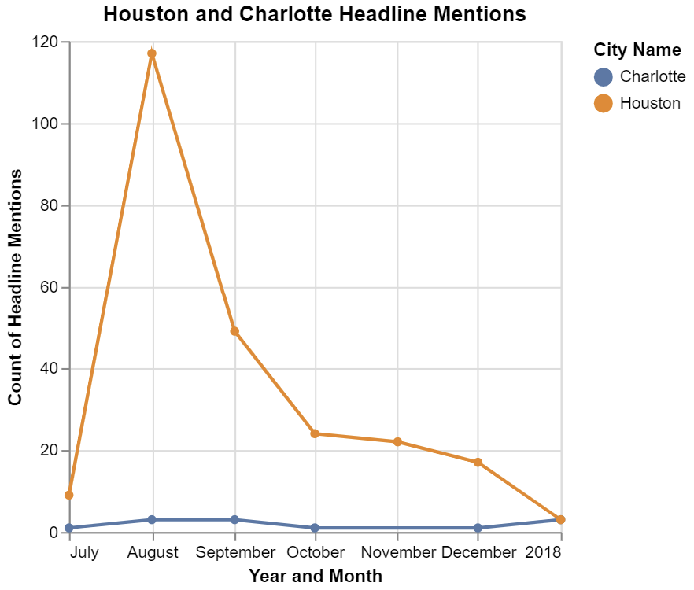

# Extra Extra! Code all about it
# Ben Fuqua
## "2021-10-27"
## class: "CSE 350 01"
## hours: 3 
## Palmer
----------------------------------------

# Chart 1
Here are the top 15 city mentions from the dataset. I was a little concerned when I saw how big the spike was for Sacramento and New york, but when I looked into some random samples of the data, I found there was a lot of weather reports for both of these cities. These reports were found commonly throughout the dataset. Then I looked into the other occurances and found things to be ok. 

# Chart 2
Here is a chart that depicts the top 15 city mentions over time. I thought for sure, when I saw the spike in Las Vegas, that it was an outlier. But when I looked it up, there was a shooting in Las Vegas on October 1st 2017. A 64 year old man from Mesquite opened fire upon a crowd attending a concert in Las Vegas. This explains the number of mentions jumping from less than 10 to almost 250.

# Chart 3
This chart was a little more difficult to make due to the way the date was formatted and the text for charoltte. There were just a few less occurances than houston at every day but when I dug into the data I found there were lots of mentions for 'Charolettsville' and the regex thought that was the same as Charlotte, NC. As for the spike of Houston, I thought this was going to be an outlier, but during August hurricane Harvey struck texas and there were many articles about the status, damage, flood watch, rescues, donations, etc of texas as time went on. Hurricane Harvey struck texas on August 17th. 
