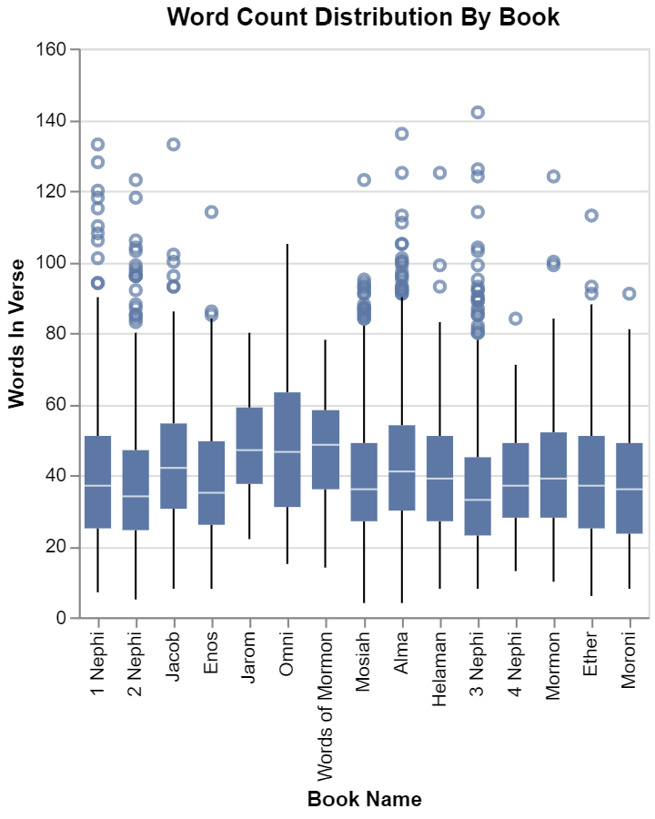

# Scripture stats
# Ben Fuqua
## "2021-10-22"
## class: "CSE 350 01"
## hours: .5 
## Palmer
----------------------------------------

# Question 1 
## What is the average verse length in the new testament compared to the Book of Mormon?
Here in this chart we can see the Book of Mormon is nearly double the average verse length than the bible! I decided to round to the nearest whole number because it doesn't make sense for there to be .4 or .6 of a verse. 

| Volume Title   |   Verse Count |
|:---------------|--------------:|
| Book of Mormon |         40 |
| New Testament  |         23 |

# Question 2
## How often is the word Jesus used in the New Testament compared to the Book of Mormon?
I will admit, this shcoked me at first to see the New Testament having around 1300 more occurances of the name 'Jesus' in the text. When I thought about it though, it does make sense because he was there walking among them. It would be the same as someone adressing Nephi or Lehi. 

| Volume Title   |  Jesus Name |
|:---------------|------------:|
| Book of Mormon |        6604 |
| New Testament  |        7957 |

# Question 3 
## How does the word count distribution by verse look for each book in the Book of Mormon?

Here is this chart we can see the average number of words per book falls between ~35 - ~50 with an astonishing max of 140+! The book with the highest count falls into 3rd Nephi, which is the book where the Nephite and Lamanite cities are destroyed due to their wickedness and the Savior comes to visit the Nephites, so it makes sense they would have a lot to write about. 

