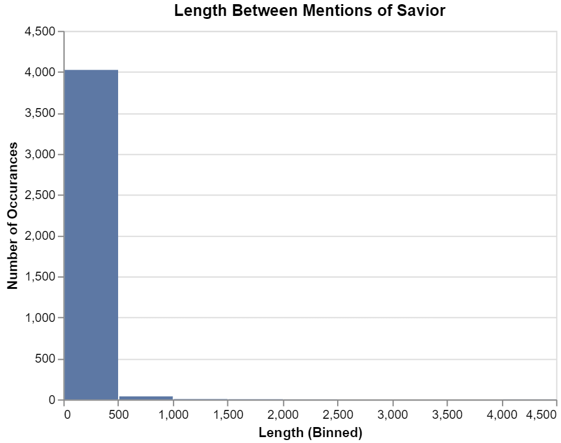
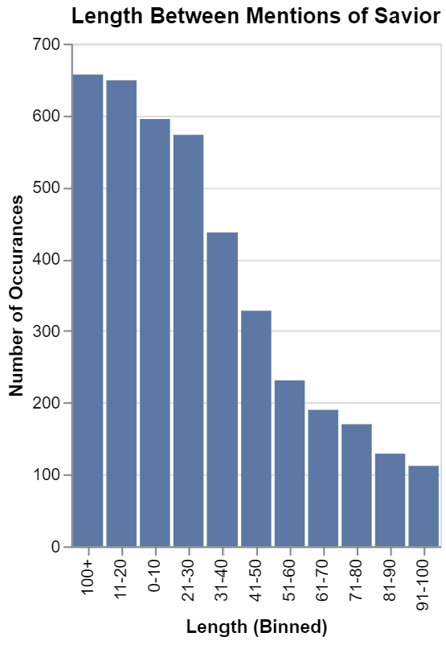

# Counting Names in the Scriptures
# Ben Fuqua
## "2021-11-5"
## class: "CSE 350 01"
## hours: 1.5 
## Palmer
----------------------------------------

# Background
We know there are many mentions of the Saviors various names in the Book of Mormon. But how often is one of his names mentioned? Below you will find 3 different visuals that describe this distribution.

Here we have a numerical representation, the number of characters between each mention and the number of words between mentions

|       |   split of characters |   split of words |
|:------|---------------------:|--------------------:|
| count |             4071     |           4071      |
| mean  |              341.624 |             66.2606 |
| std   |              687.816 |            127.93   |
| min   |                1     |              2      |
| 25%   |               79     |             17      |
| 50%   |              176     |             35      |
| 75%   |              380     |             74      |
| max   |            21834     |           4029      |

The distribution is pretty tight, but we do have some long portions between mentions (the top 5 being 4029,2394,1733,1703 and 1536). Next we have a binned bar graph that is set to the default bins. As you can see, the distribution is quite large as 4000 of our values appear in the first bin.

This next binned bar graph is set with manual bins so as to create a more accurate representation of the distribution. It is ordered by highest bin to lowest bin. 

