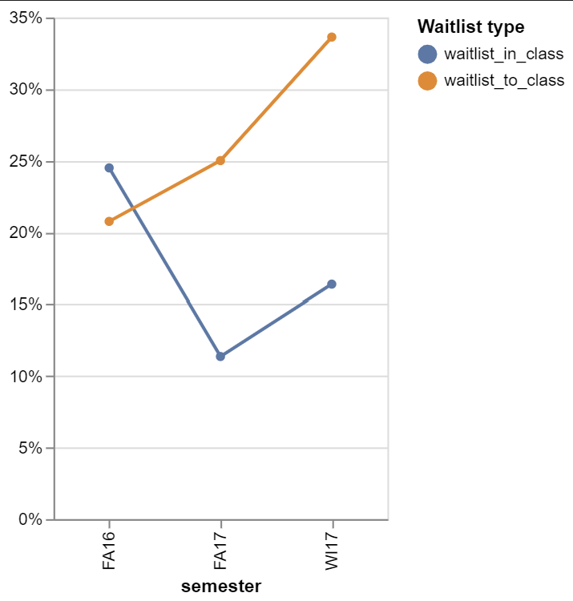
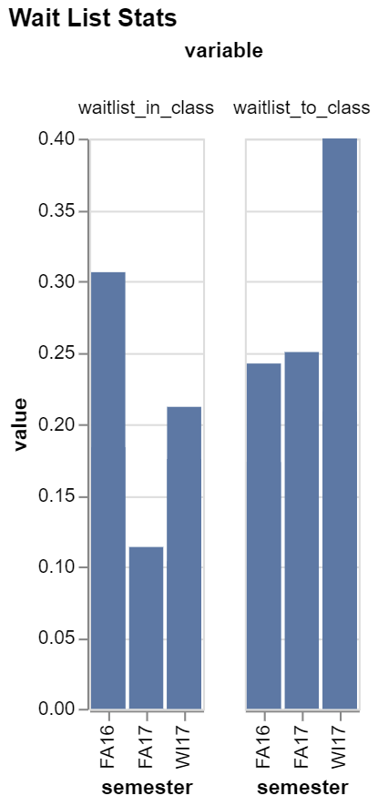

# Waitlisted... Again
# Ben Fuqua
## "2021-11-3"
## class: "CSE 350 01"
## hours: 1.5 
## Palmer
----------------------------------------

# Background
Now that we have explored only section 18 of FDMAT108 lets take a look t all of the other sections and what their trends look like. Since the actual data is rather small, I printed out the whole table

|    | semester   | course_sec   |   waitlist_in_class |   waitlist_to_class |
|---:|:-----------|:-------------|--------------------:|--------------------:|
|  2 | FA16       | FDMAT108-15  |            0.306122 |            0.241935 |
|  5 | FA16       | FDMAT108-14  |            0.183673 |            0.173077 |
|  0 | FA17       | FDMAT108-33  |            0.113636 |            0.25     |
|  1 | WI17       | FDMAT108-A3  |            0.103448 |            0.4      |
|  3 | WI17       | FDMAT108-18  |            0.212121 |            0.208955 |
|  4 | WI17       | FDMAT108-53  |            0.175439 |            0.4      |

The first trend that stuck out to me was in the waitlist to class variable. This variable describes how many students got into the class from the wait list divided by the total number of students on the wait list. Below we can see the number of students who are on the wait list go up, which means good news for those on the wait list! 

The next trend I noticed was by semester. Below we can see close to the same value for the waitlist to class variable whcih makes me wonder, if we had another data point for W16, would we see a similar data point to W17?

