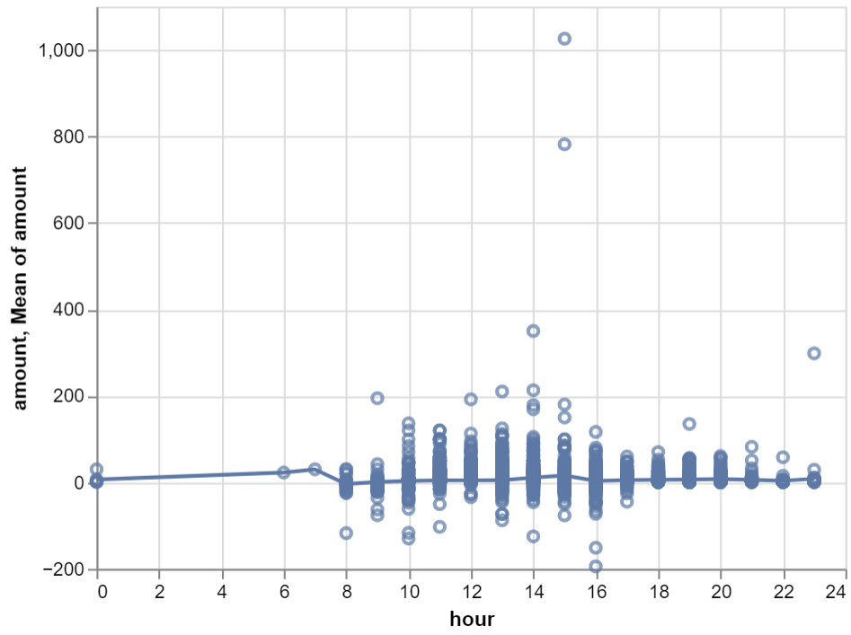
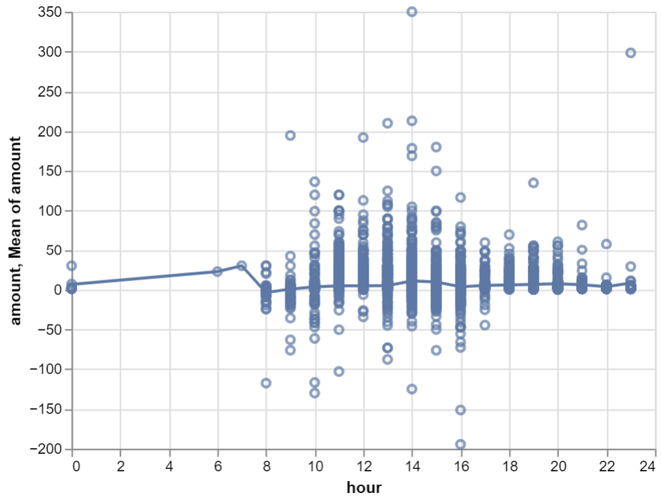
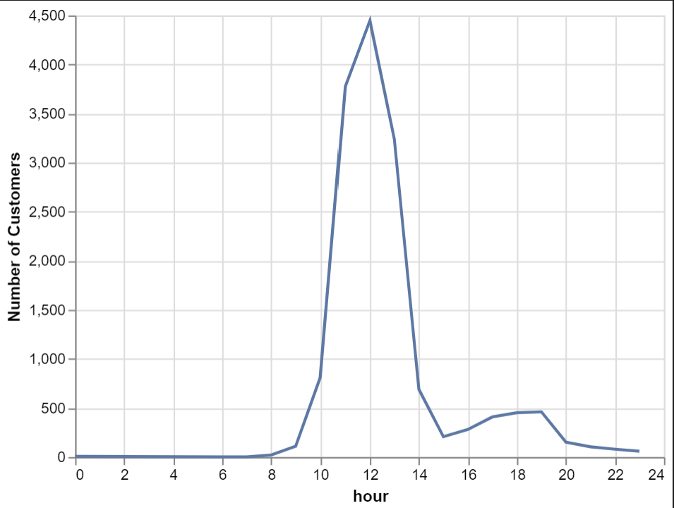
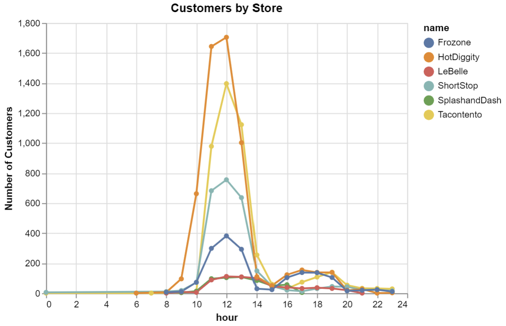
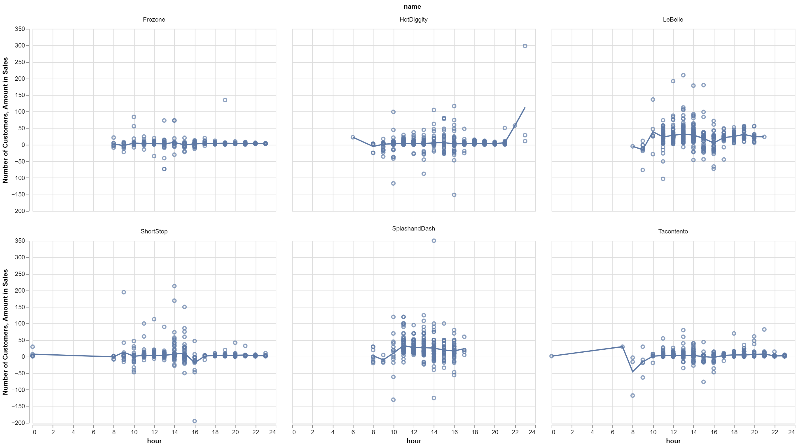

# Homework Title
# Ben Fuqua
## "2021-11-10"
## class: "CSE 350 01"
## hours: 1.5 
## Palmer
----------------------------------------

### Question 1: Provide an understanding and recommendation for hours of operation & Question 2:  Provide some visualizations on customer traffic.

When I first looked at the data, I got the first chart. It seemed weird there would be such a drastic jump from 2:00 - 4:00. So I decided to take a look at the descriptive summary, found below the graph. When I saw the standard deviation was only 15.4, I knew something was off. When we take the mean (5.29) and add 3 standard deviations (46.2) we get 51.5, which is still roughly 63 standard deviations away. I decided to cap it at 400, because we start to see a couple more points between 200 & 400. the new graph can be found below. There are some negative values here, those could mean a couple of things: refunds they had to give, they took a loss in revenue that day, or products they spent materials on weren't sellable. So, with all of this in mind, I would say the best times of operation for the business would be between 10AM and 5PM because these are the hours that seem to be getting the most amount of traffic from customers. 

#### Chart 1

#### Chart 2
|       |      amount |
|:------|------------:|
| count | 15654       |
| mean  |     5.28565 |
| std   |    15.4404  |
| min   |  -194.5     |
| 25%   |     2.5     |
| 50%   |     3       |
| 75%   |     4.5     |
| max   |  1026       |

#### Chart 3

#### Chart 4

### Question3 Provide a final comparison of the six companies and a final recommendation.
To start off, I wanted to look at the customer traffic by store in the first graph. For all of the stores, I think it would be best if they were open by 9:00 AM every day, then took a break between 2:00PM and 3:00PM for lunch then they would be able to hit their afternoon rush from 3:00PM - 8:00PM. This way they are working for about 8-10 hours per week depending on how long they wanted to work. 

In the next graph, I created a graphic that shows the distribution of sales per hour, faceted by company with the mean sales line running over the top. As we can tell, that 9-2 and 3-8 time block matches well with the sales graph, there is a peak, and then a lull, and then another peak. 

The last graphic is here to explain the total sales each company made. This does include the negative values, and as we can see, HotDiggity was the company who out performed all of the other companies by about 5K+. 

#### Chart 1

#### Chart 2

#### Chart 3
| name          |   amount |
|:--------------|---------:|
| HotDiggity    | 21119.1  |
| LeBelle       | 16063.3  |
| Tacontento    | 14482.4  |
| SplashandDash | 13427.7  |
| ShortStop     | 10100.8  |
| Frozone       |  5740.53 |