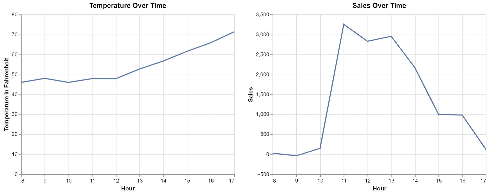
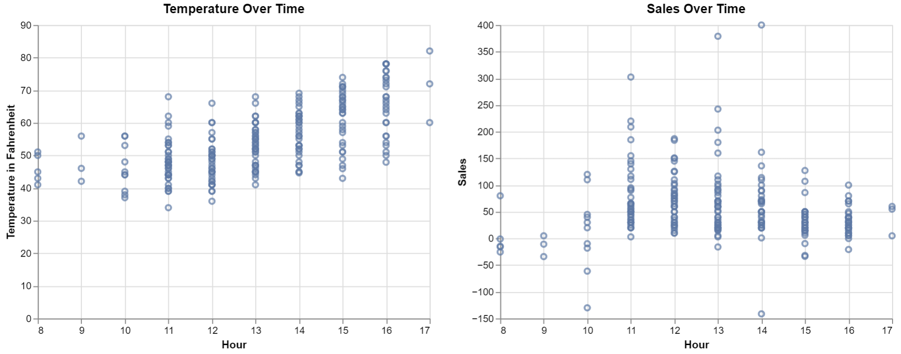

# Does The Weather Hurt
# Ben Fuqua
## "2021-11-8"
## class: "CSE 350 01"
## hours: 1.5 
## Palmer
----------------------------------------

## Graph
These two graphs represent the temp and sales respectively. The temp graph is the average temp of that hour over the dataset and sales is the total (sum) number of sales in that hour. I wouldn't say there is a strong correlation between the two variables when we look at the average of the temp and sum of the sales. But, when we take the raw values and plot them we get the second chart. Generally we see as time goes on, the temperature goes up and the sales go down. I wouldn't call this a causitive relationship but I would say there is a loose correlation.

