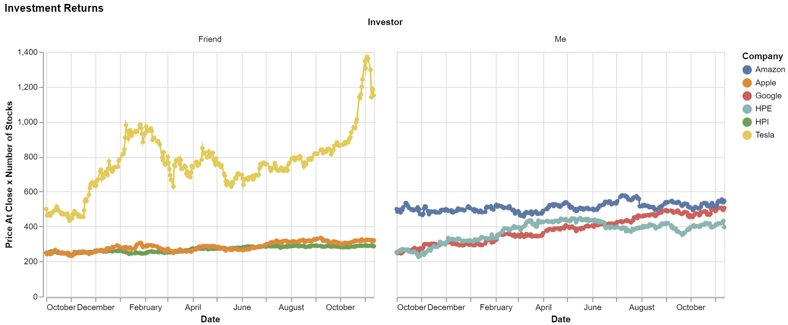
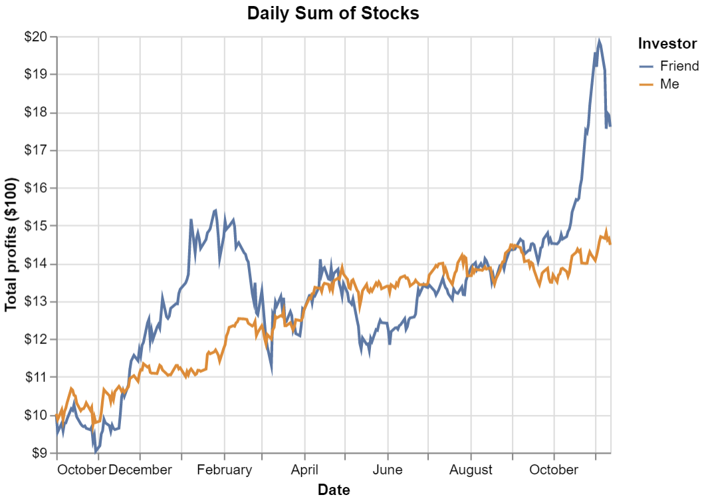

# My Investment Is Better Than Yours
# Ben Fuqua
## "2021-11-15"
## class: "CSE 350 01"
## hours: .5 
## Palmer
----------------------------------------
# List of Stocks and Initial Investment
|    | Date                | investor   | company   |   amt_invest |
|---:|:--------------------|:-----------|:----------|-------------:|
|  0 | 2020-10-01  | Friend     | Tesla     |          500 |
|  1 | 2020-10-01  | Friend     | HPI       |          250 |
|  2 | 2020-10-01  | Friend     | Apple     |          250 |
|  3 | 2020-10-01  | Me         | Google    |          250 |
|  4 | 2020-10-01  | Me         | HPE       |          250 |
|  5 | 2020-10-01  | Me         | Amazon    |          500 |

## Return on Investment Over Time
In the tables below, I printed out the final return on investment in the 'outcome' column and the total amount of the three stocks combined in the 'total' column. From the graphic below, we can see the friend won thanks to Tesla, who's value more than doubled over this time frame. 

|    | investor   | company   |   outcome |total|
|---:|:-----------|:----------|----------:|---:|
|  0 | Friend     | Apple     |   320.979 |1760.42|
|  1 | Friend     | HPI       |   287.176 |1760.42|
|  2 | Friend     | Tesla     |  1152.26  |1760.42|
|  3 | Me         | Amazon    |   546.398 |1448.5|
|  4 | Me         | Google    |   505.505 |1448.5|
|  5 | Me         | HPE       |   396.598 |1448.5|

